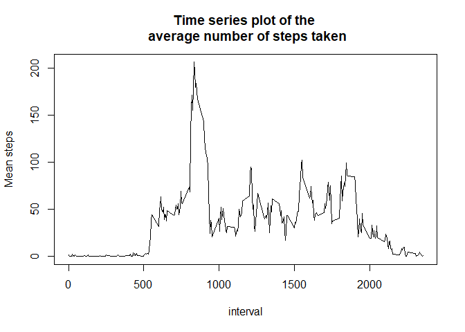
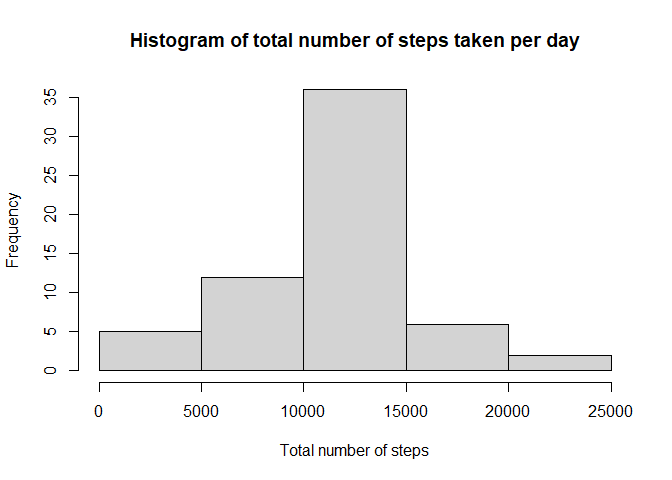
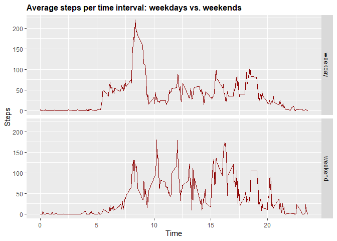

## I.Loading and preprocessing the data

```r
filename<-"activity.zip"
if (!file.exists("activity.csv")) { 
  unzip(filename) 
}
dt <- read.csv("activity.csv", header = T)
```
#### Looking what the data contains

```r
str(dt)
```

```
## 'data.frame':	17568 obs. of  3 variables:
##  $ steps   : int  NA NA NA NA NA NA NA NA NA NA ...
##  $ date    : chr  "2012-10-01" "2012-10-01" "2012-10-01" "2012-10-01" ...
##  $ interval: int  0 5 10 15 20 25 30 35 40 45 ...
```

```r
head(dt)
```

```
##   steps       date interval
## 1    NA 2012-10-01        0
## 2    NA 2012-10-01        5
## 3    NA 2012-10-01       10
## 4    NA 2012-10-01       15
## 5    NA 2012-10-01       20
## 6    NA 2012-10-01       25
```

```r
tail(dt)
```

```
##       steps       date interval
## 17563    NA 2012-11-30     2330
## 17564    NA 2012-11-30     2335
## 17565    NA 2012-11-30     2340
## 17566    NA 2012-11-30     2345
## 17567    NA 2012-11-30     2350
## 17568    NA 2012-11-30     2355
```
#### checking the missing values

```r
missing_dt <- dt[is.na(dt$steps),]
mean(is.na(dt$steps))
```

```
## [1] 0.1311475
```

```r
dim(missing_dt)
```

```
## [1] 2304    3
```
## II.What is mean total number of steps taken per day?
For this part of the assignment, you can ignore the missing values in the dataset.
1. Calculate the total number of steps taken per day.

```r
# The data without any missing values
dt1 <- dt[!is.na(dt$steps),]

# Calculate the total number of steps taken per day
total_number_steps <- with(dt, tapply(steps, as.factor(dt$date), sum, na.rm = T))
```
2. Make a histogram of the total number of steps taken each day


```r
hist(total_number_steps, main = "Histogram of total number of steps taken per day", xlab = "Total number of steps")
```

<!-- -->
3.Calculate and report the mean and median of the total number of steps taken per day

```r
summary(total_number_steps)
```

```
##    Min. 1st Qu.  Median    Mean 3rd Qu.    Max. 
##       0    6778   10395    9354   12811   21194
```
## III. What is the average daily activity pattern?
1. Make a time series plot (i.e. type = “l”) of the 5-minute interval (x-axis) and the average number of steps taken, averaged across all days (y-axis)

```r
mean_steps <- with(dt1, tapply(steps, dt1$interval, mean))
interval <- levels(as.factor(dt1$interval))
plot(interval, mean_steps, type = "l", main = "Time series plot of the \n average number of steps taken", xlab = "interval", ylab = "Mean steps")
```

<!-- -->

2.Which 5-minute interval, on average across all the days in the dataset, contains the maximum number of steps?

```r
table <- data.frame(mean_steps, interval)
table[table$mean_steps==max(table$mean_steps),][2]
```

```
##     interval
## 835      835
```

## IV. Imputing missing values
Note that there are a number of days/intervals where there are missing values (coded as NA). The presence of missing days may introduce bias into some calculations or summaries of the data.

1. calculate and report the total number of missing values in the dataset (i.e. the total number of rows with NAs)

```r
# total number of missing values in the dataset
length(missing_dt$steps)
```

```
## [1] 2304
```
2. Devise a strategy for filling in all of the missing values in the dataset. The strategy does not need to be sophisticated. For example, you could use the mean/median for that day, or the mean for that 5-minute interval, etc.

```r
# in this exercise I am going to replace the missing values by the the average number of steps taken, averaged across all days.
# Using this method we do not affect this data
mean_steps <- with(dt1, tapply(steps, dt1$interval, mean))
missing_dt$steps <- mean_steps
```
3.Create a new dataset that is equal to the original dataset but with the missing data filled in.

```r
#Create a new dataset that is equal to the original dataset but with the missing data filled in.

new_dt <- rbind(dt1, missing_dt)
new_dt <- new_dt[order(new_dt$date), ]
```
4.Make a histogram of the total number of steps taken each day and Calculate and report the mean and median total number of steps taken per day. Do these values differ from the estimates from the first part of the assignment? What is the impact of imputing missing data on the estimates of the total daily number of steps?

```r
total_number_steps2 <- with(new_dt, tapply(steps, as.factor(new_dt$date), sum))
#Make a histogram of the total number of steps taken each day
hist(total_number_steps2, main = "Histogram of total number of steps taken per day", xlab = "Total number of steps")
```

<!-- -->
4.1Calculate and report the mean and median of the total number of steps taken per day.
Mean and median total number of steps taken per day WITHOUT filling in the missing values

```r
summary(total_number_steps)
```

```
##    Min. 1st Qu.  Median    Mean 3rd Qu.    Max. 
##       0    6778   10395    9354   12811   21194
```
Mean and median total number of steps taken per day WITH filling in the missing values

```r
summary(total_number_steps2)
```

```
##    Min. 1st Qu.  Median    Mean 3rd Qu.    Max. 
##      41    9819   10766   10766   12811   21194
```
Yes, mean and median total number of steps taken per day for the filled in missing values differ from these of the origional dataset.
## V. Are there differences in activity patterns between weekdays and weekends?
For this part the weekdays() function may be of some help here. Use the dataset with the filled-in missing values for this part.
1. Create a new factor variable in the dataset with two levels - “weekday” and “weekend” indicating whether a given date is a weekday or weekend day.

```r
# Create variable with date in correct format
new_dt$RealDate <- as.Date(new_dt$date, format = "%Y-%m-%d")
# create a variable with weekdays name
new_dt$weekday <- weekdays(new_dt$RealDate)
# create a new variable indicating weekday or weekend
new_dt$DayType <- ifelse(new_dt$weekday=='sabado' | new_dt$weekday=='domingo', 'weekend','weekday')
# see first 10 values
head(new_dt, n=10)
```

```
##        steps       date interval   RealDate weekday DayType
## 1  1.7169811 2012-10-01        0 2012-10-01   lunes weekday
## 2  0.3396226 2012-10-01        5 2012-10-01   lunes weekday
## 3  0.1320755 2012-10-01       10 2012-10-01   lunes weekday
## 4  0.1509434 2012-10-01       15 2012-10-01   lunes weekday
## 5  0.0754717 2012-10-01       20 2012-10-01   lunes weekday
## 6  2.0943396 2012-10-01       25 2012-10-01   lunes weekday
## 7  0.5283019 2012-10-01       30 2012-10-01   lunes weekday
## 8  0.8679245 2012-10-01       35 2012-10-01   lunes weekday
## 9  0.0000000 2012-10-01       40 2012-10-01   lunes weekday
## 10 1.4716981 2012-10-01       45 2012-10-01   lunes weekday
```
2.Make a panel plot containing a time series plot (i.e. type = “l”) of the 5-minute interval (x-axis) and the average number of steps taken, averaged across all weekday days or weekend days (y-axis). See the README file in the GitHub repository to see an example of what this plot should look like using simulated data.

```r
library(ggplot2)
```

```
## Warning: package 'ggplot2' was built under R version 4.0.2
```

```r
# create table with steps per time across weekdaydays or weekend days
StepsPerTimeDT <- aggregate(steps~interval+DayType,data=new_dt,FUN=mean,na.action=na.omit)
# variable time (more comprensible for the graph axis)
StepsPerTimeDT$time <- StepsPerTimeDT$interval/100
# draw the line plot
j <- ggplot(StepsPerTimeDT, aes(time, steps))
j+geom_line(col="darkred")+ggtitle("Average steps per time interval: weekdays vs. weekends")+xlab("Time")+ylab("Steps")+theme(plot.title = element_text(face="bold", size=12))+facet_grid(DayType ~ .)
```

<!-- -->

